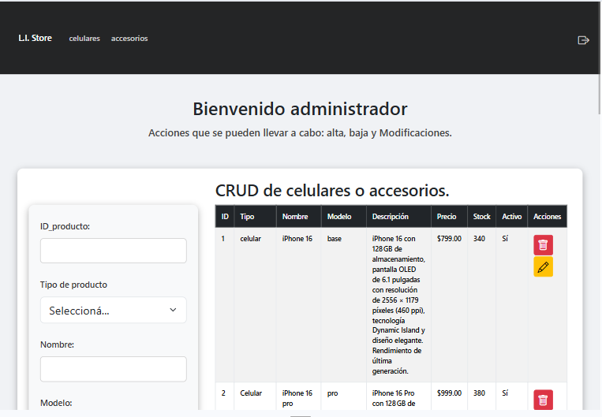
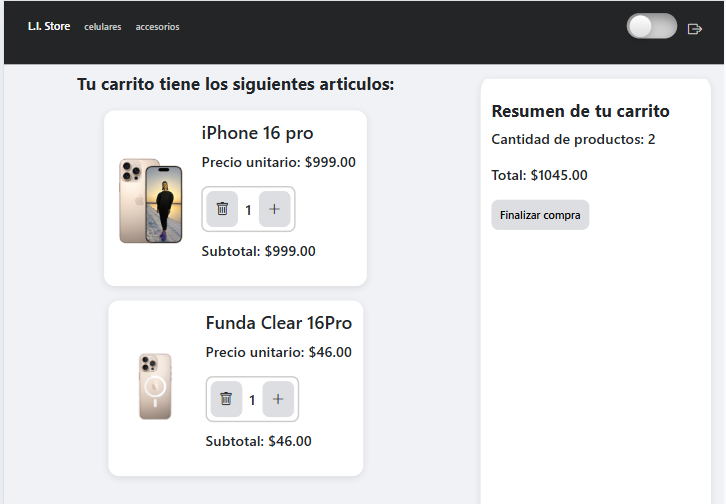
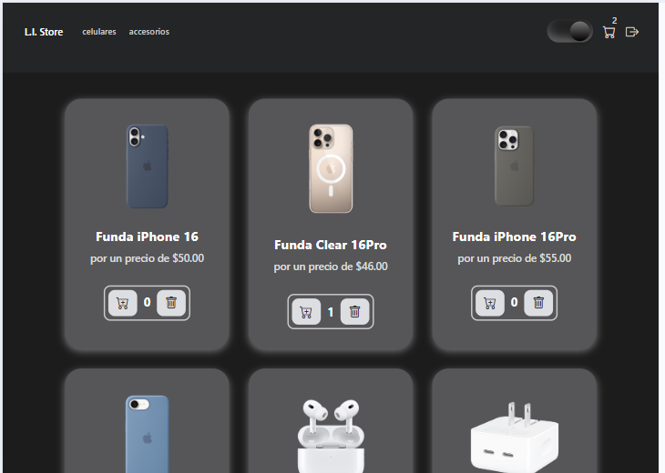

# L.I. Store - Tienda de Tecnología
Proyecto final para Programación III de la carrera Tecnico Universitario en Programacion en la Universidad Tecnológica Nacional de Avellaneda (UTN).
- Alumnos: Lucila Micaela Suarez, Ignacio Pepe Valverde y Juan Pablo Rodrigues Ferreira Maltez.
- Profesores: Ricardo Gastón Plazas y Gabriel Muñoz.

### Descripción
L.I. Store es una aplicación web de e-commerce que permite a los usuarios visualizar productos (celulares y accesorios), agregarlos a un carrito y gestionar compras. Los administradores pueden dar de alta, baja o modificar productos desde un panel privado.

## Estructura
L. I. Store
├── backend/
│  ├── controllers/
|  ├── data/
|  ├── middlewares/
│  ├── models/
|  ├── node_modules/
|  ├── public/
│  ├── routes/
|  ├── scripts/
|  ├── .env
|  ├── .gitignore
|  ├── index.js
|  ├── package-lock.json
│  └── package.json
├── frontend/
│  ├── estilos/
|  ├── funciones/
│  ├── img/
│  └── screens/
├── DER  
├── Guia_de_uso
└── README.md

## Tecnologias Utilizadas
Frontend: HTML5, CSS3, JavaScript (puro), Bootstrap 5
- Backend: Node.js, Express
- Base de datos: MySQL
- ORM: Sequelize
- Control de versiones: Git + GitHub

## Instalacion y configuracion
Para instalar y ejecutar este proyecto, sigue estos pasos:
1. Clonar el repositorio
''' bash
    git clone https://github.com/tu-usuario/l.i.store.git
    cd l.i.store '''
2. Instalar dependencias del backend:
    cd backend
    npm install
3. Configurar las variables de entorno:
    Crear un archivo .env en la raíz del proyecto y completar:
        DB_HOST=localhost
        DB_NAME=li_store
        DB_USER=root
        DB_PASSWORD=tu_contraseña
        DB_PORT=3306
        PORT=3030
4. Importar la base de datos:
''' bash
    npx sequelize db:migrate '''
5. Inicia el servidor:
''' bash
    npm run dev '''
6. Accede a la aplicación a través de [http://localhost:3030](http://localhost:3030)

## 🖥️ Funcionalidades principales
    👤 Usuario (Frontend)
    - Ver productos activos (filtrados por tipo(celulares y accesorios)).
    - Agregar/quitar productos al carrito.
    - Contador global del carrito.
    - Persistencia con localStorage.
    🛠️ Admin (Backend)
    - Crear, modificar, desactivar productos.
    - Filtrado por tipo y estado (activo=true/false).
    - Endpoints RESTful para gestión de productos.

## Endpoints destacados
| Método | Ruta                       | Descripción                |
| ------ | -------------------------- | -------------------------- |
| GET    | /productos                 | Listar todos los productos |
| GET    | /productos?tipo=celular    | Filtrar por tipo           |
| POST   | /productos                 | Crear producto             |
| PUT    | /productos/:id/            | Modificar producto         |
| PUT    | /productos/:id/desactivar  | Dar de baja (soft delete)  |
| GET    | /productos/:id/            | Obtener producto por ID    |

## Pruebas con Postman
Los endpoints pueden probarse con Postman usando un token de autorización.
- Ejemplo:
    - 'GET http://localhost:3030/productos?tipo=celular&activo=true'
    - 'PUT http://localhost:3030/productos/:id' (requiere token y JSON válido)

## Interfaces de Usuario
- 
Tabla de los productos que ve el administrador donde se pueden crear, modificar y desactivar productos mediante endpoints protegidos.

- 
Vista del carrito, donde el usuario puede ver los productos agregados, sus cantidades y agregar o eliminar elementos.

- 
El usuario visualiza los accesorios activos, con la opcion de agregarlos a su carrito. 

## Autores
- Lucila Micaela Suarez
- Ignacio Pepe Valverde
- Juan Pablo Rodrigues Ferreira Maltez

Proyecto final. Programación III. Julio, 2025.